# <u>**Introduction to UAV Mapping**</u>

Over the last decade, we have seen a dramatic increase in technology and interest in consumer grade UAVs. Much of this interest has came from the desire to use these platforms for aerial photography and video making. To feed this need, manufactures made made the UAVs easier to fly, safer, and a very capable camera platform. Seeing an opportunity, software developers have turned these consumer drones into very capable aerial mapping platforms. This report is a brief discussion on what UAV mapping is, its benefits, and how to perform it.

### What is UAV Mapping?

UAV mapping is a generic term that is used to describe the use of a unmanned platform to produce a model of the surface it has imaged. These products do include orthomosaic photos, elevation models, 3D models, and vegetation indexing (with the appropriate sensor). What makes this possible is the high resolution image that the UAV generates and the position data that is attached to that image. 

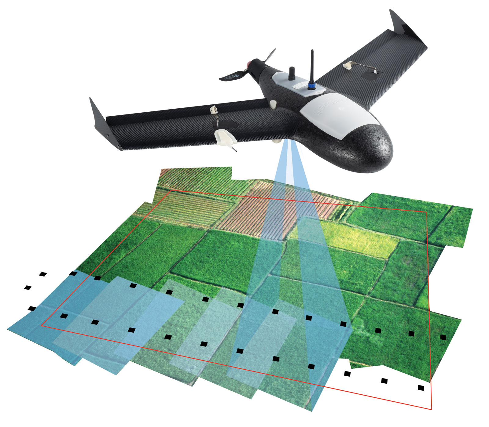

Knowing the location and orientation of the photo when it is taken allows, the mapping software to perform the photogrammetry process. **Photogrammetry** is the science of making measurements from photographs, especially for recovering the exact positions of surface points. Photogrammetry is as old as modern photography, dating to the mid-19th century and in the simplest example, the distance between two points that lie on a plane parallel to the photographic [image plane](https://en.wikipedia.org/wiki/Image_plane), can be determined by measuring their distance on the image, if the scale of the image is known.

Photogrammetric analysis may be applied to one photograph, or may use [high-speed photography](https://en.wikipedia.org/wiki/High-speed_photography) and [remote sensing](https://en.wikipedia.org/wiki/Remote_sensing) to detect, measure and record complex 2-D and 3-D motion fields by feeding measurements and [imagery analysis](https://en.wikipedia.org/wiki/Imagery_analysis) into [computational models](https://en.wikipedia.org/wiki/Computer_simulation) in an attempt to successively estimate, with increasing accuracy, the actual, 3-D relative motions. 

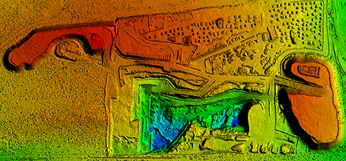

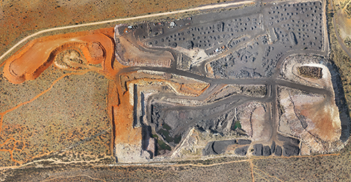

*Some of the types of products that are generated by UAV mapping.*

In basic terms, the software looks for identical pixels in multiple photos, considers where that image was taken in relation to the other photos, and reconstructs the surface based on this relationship. 

### Why is it beneficial?

At the end of the day, using a UAV for photogrammetry can be very beneficial for many different types of people. As a remote sensing platform, it is much safer and financially accessible to the scientific community than its manned aircraft counterpart. A $1000 dollar UAV is very capable of creating very detailed maps. In many cases, the mapping software is much more expensive than the actual UAV. But even then, the financial commitment is much less than a manned aircraft. Since this the case, most customers contract an outside company to perform the data collection process. In this case, the customer can perform this operations on their own. This gives them not only a temporal advantage, but in many cases a spatial resolution advantage as well. Outside of the scientific community, farmers and construction companies can benefit as well. These products are very accessible and fairly easy to generate. This allows these professionals to more effectively manage their crops or construction site, which should increase their profit margin.

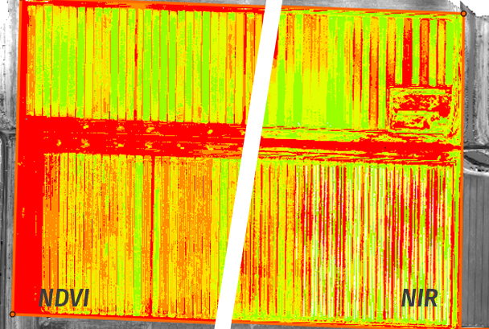

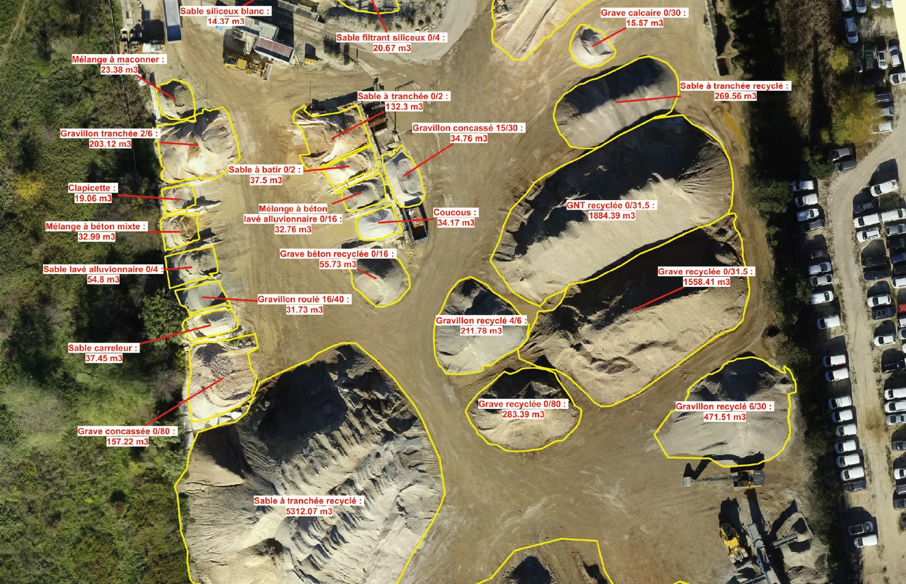

*Indexed vegetation and volume calculation examples.*

### Factors to consider 

##### Flight Planning

First, the pilot must determine if the desired location can be mapped legally. In many cases, the desired airspace could be restricted. Such as specific airspace for a nearby airport, National Park, and wildlife refuges. Additionally an organization, such as the USFS, may require additional approval to perform a flight in the name of research.

Careful thought needs to be given when planning the flight for the data collection. The pilot needs to consider what is the goal of the flight. Is it to generate a 3D model or 2D model? And if it is a 3D model, is it one object of multiple objects? The answer to this question determines what kind of flight profile will be needed. 

For a 2D model, a simple parrel grid pattern works best. The altitude and photo overlap will determine the level of resolution for the model.

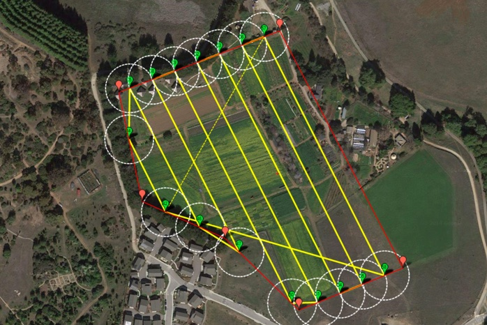

For a 3D model of one object, performing multiple altitudes will work the best. The benefit of flying multiple orbits is that it gives the software a better perspective of the sides of the particular object.  

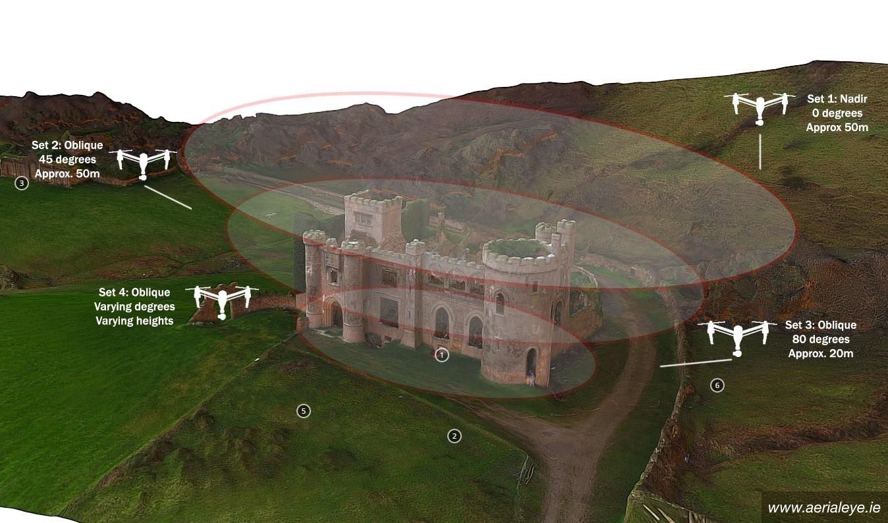

For a 3D model of multiple objects, the pilots best profile option is performing two parallel grid patterns that intersect each other at a perpendicular angle. In the end, it most likely will not render as good of a model as the single object, but this is a sacrifice that will have to be made when modelling multiple objects.

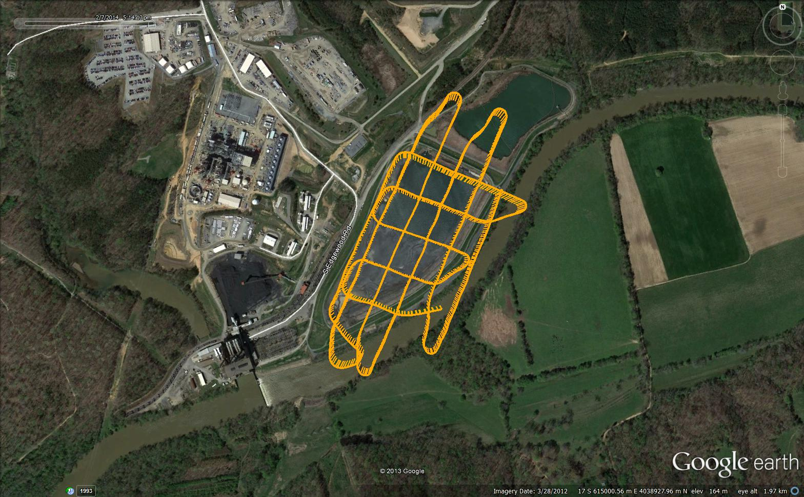

##### Time of Day and Weather

The pilot needs to consider the time of day the flight will be conducted and what the weather may be like. The orientation of the sun will not only affect how much of shadowing an object will have, but also how much light saturation the images will have as well.

*Photos illustrating the affects of sunlight orientation*

The weather also affects the effectiveness of a flight as well. First, consumer UAVs are not attended to fly in incliment weather. Second, if the cloud cover is scattered, it can affect the constancy of lighting and ultimately the image quality of the model. However, if the clouds provide a solid overcast, it may be satisfactory conditions. That being said, it should be anticipated that the images will be darker.

Ultimately, the best time to perform the flight is in clear conditions and with the sun at its highest point in the sky.

##### Safety

A pilot is required to consider some safety hazards in order to ensure that the flight is legally and safely executed. The below image provides the basics of the FAA requirements. It is important to realize that these are the basics of recreational use. When conducting flights for research or commercial application, there are many other requirements that most be made.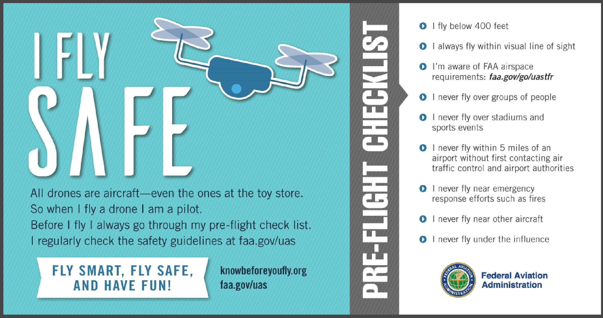

Additionally, the pilot must ensure that the flight profile is sufficiently above all obsticales in the area. This is to ensure that the UAV does not run into an object when it is flying its grid pattern. Finally, the pilot should also consider the wind conditions not only at the surface, but at the profile altitude as well.

##### Desired accuracy

Depending on the application of the model data, the accuracy must be considered. If it is just for general use, the GPS accuracy of the UAV may be satisfactory. However, if accuracy is critical to the purpose of the model, then the inclusion of ground control points (GCP) must be considered.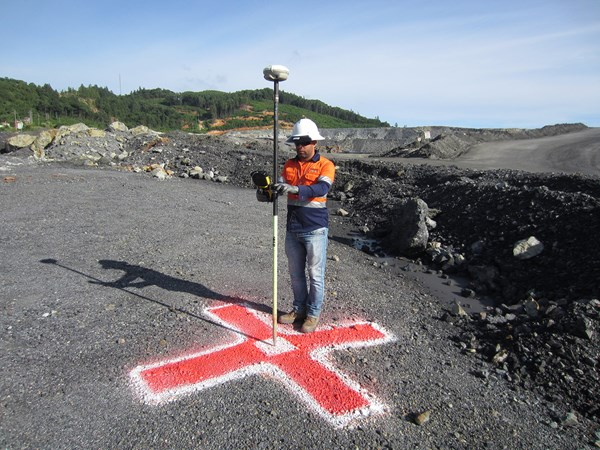

### Performing the flight profile

The type of profile (2D vs 3D) and the pilots proficiency will ultimately determine how it is executed. If the profile is for a 3D model and in a tight setting, the pilot may decide to fly the profile manually. However, in most cases, most profiles can be completed through the use of a automated application from their smart device. These applications are intended to be used with their companion software package. When utilized, the profile is programmed through the smart device and is flown completely automatically when executed. After profile completion, regardless of execution, is uploaded to the desired software. From there, the image processing may begin. Remember to keep the UAV in sight at all times and be ready to take manual control if necessary. 

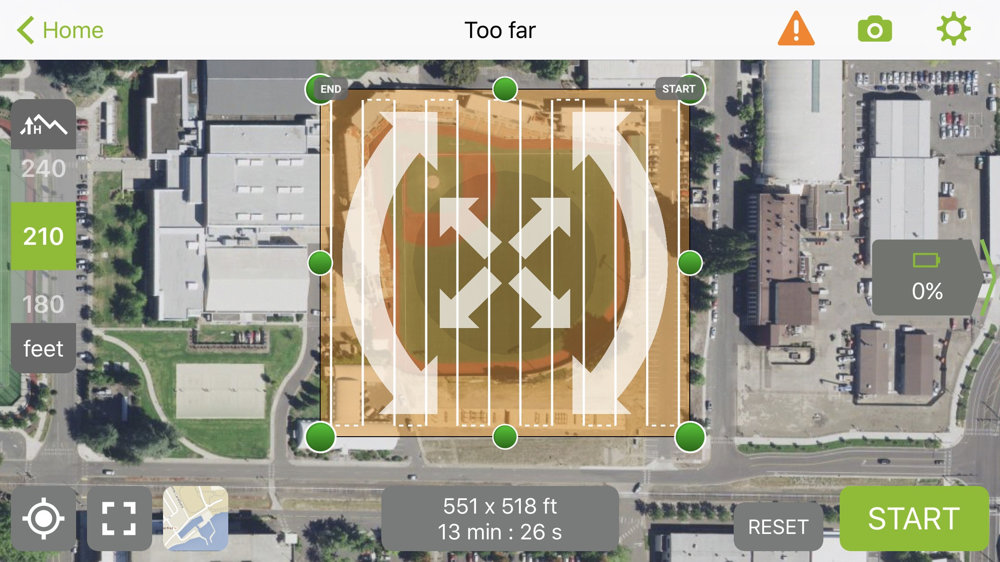

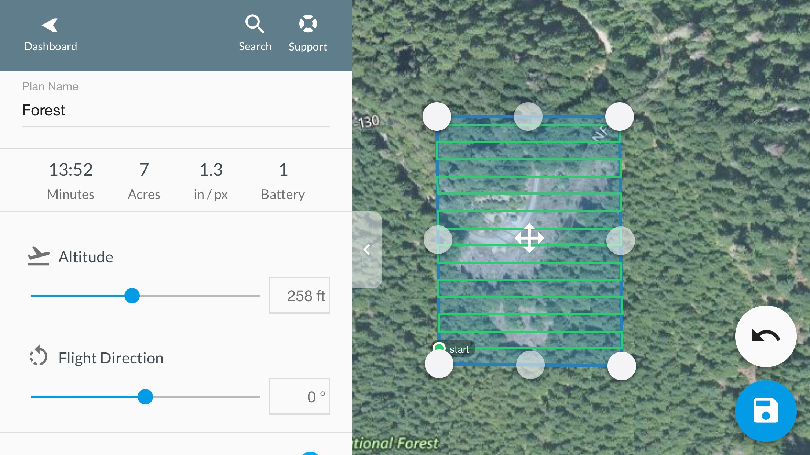

*Interface of the Pix4D Capture (top) and DroneDeploy (bottom) applications*

### Photo Processing

When profile is completed, the processing steps varies dramatically depending on the individual software package. Some options are completely cloud based and allow for a simplified process. Additionally, because of the extremely high amount of computer processing that is required, a cloud based option allows you to free up your personal workstation. Other options provide the user much more control over the processing, but require more time and attention to detail. 

In most cases, the first step is uploading the images to the software. Next, all the photos must be aligned and orientated. When this step is performed, the software identifies specific points (such as sharp points or edges) which renders a primitive point cloud.

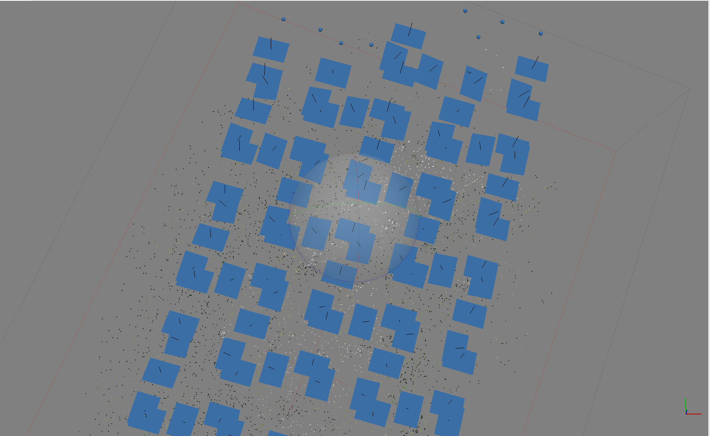

Next, the software will construct a dense point cloud. This step, in most cases, is the most time consuming in terms of shear processing time. Depending on the number of photos and selected settings, this process could easily take over a day. Once created, the software will be able to generate a 3D model and digital elevation model. Finally, once the elevation model has been generated, the orthophoto may be constructed.

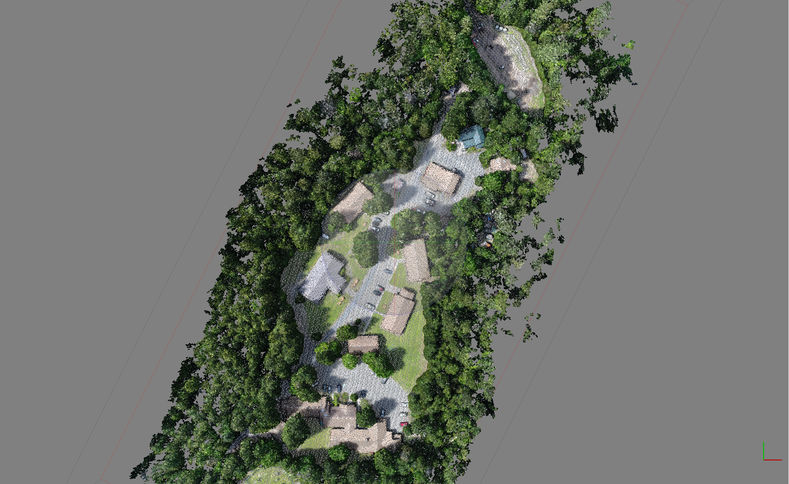

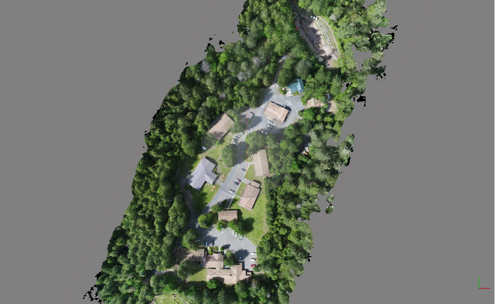

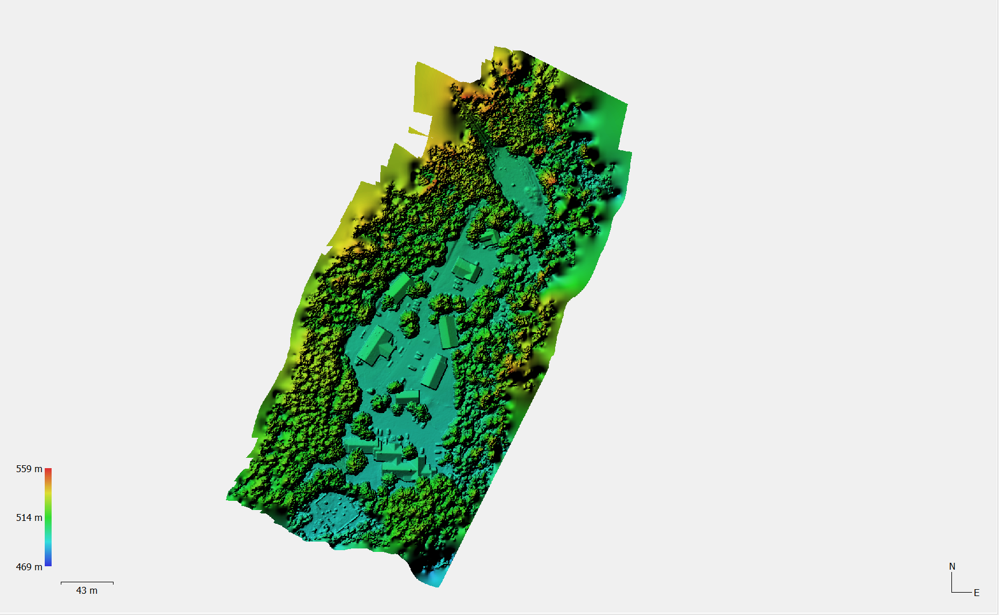

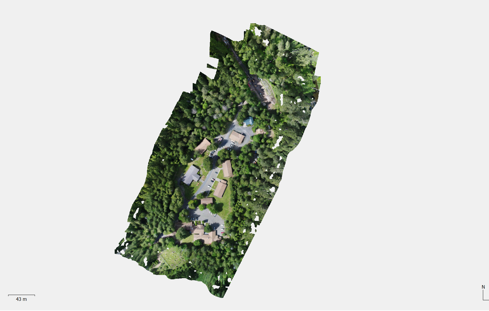

*Images of dense cloud (top), 3D model (middle-top), DEM (middle-bottom), and orthophoto (bottom)*

Remember that the processing time is greatly affected by the number and file size of photos, computer hardware, and the user settings.

### Exporting

Similar to processing, the ability to export the data is greatly determined by the software being utilized. In most cases, the rasters (DEM and Ortho) can be exported in the form of a georeferenced .tiff file. This format makes it very easy to import the data into a GIS program. Additionally, by being in a .tiff format, the data will be able to be uploaded into a web service as well, such as GeoServer. The 3D objects are most often exported in a .obj format and can be difficult to work with due to their file size.

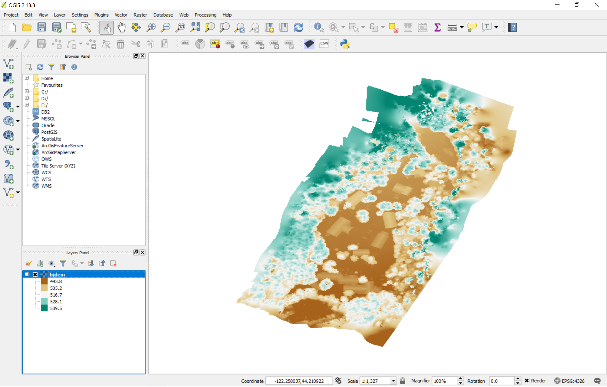

*DEM created from UAV loaded into QGIS*

### Popular Software Options

https://pix4d.com/

https://www.dronedeploy.com/

http://www.agisoft.com/

http://www.esri.com/products/drone2map

### Videos Illustrating Capabilities

https://www.youtube.com/watch?v=AOXmju2bCpQ

With a multispectral camera:

https://www.youtube.com/watch?v=XF306Hp6Q4I

### Oregon State University UAS Research

When conducting UAV mapping in the name of research while attached to OSU, the pilot must complete a flight safety course. A pilot is not required to have a Part 107 license from the FAA. However, if operating under the OSU COA without Part 107, there must be a NOTAM filed.

http://research.oregonstate.edu/unmanned-systems-initiative/uas-osu/home

### Conclusion

The area of UAV mapping is rapidly growing. Manufactures and software developers alike are rapidly advancing the technology and capabilities of the platforms. For many of us in the geospatial analysis community, these platforms can provide us an ease of access to legitimate remote sensing platforms. Just remember to educate yourself prior to attempting to ensure that you are doing so safely and legally. 

